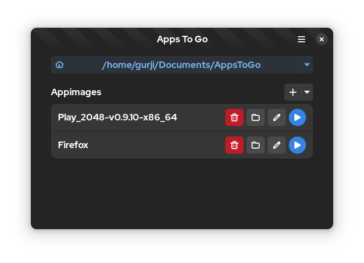

# AppToGo

AppToGo is an application that allows you to run Appimages in portable mode, so that they can be run on almost all modern linux distributions without the need for installation, and with all the data.

## Installation

Use the Appimage in Releases, or from Github actions.

## Screenshots



## How it Works

1. Upon launching the application, the user is prompted to select a folder where the Portable App will store its data.
   - A JSON file is created to save the list of apps for future loading, so that the AppToGo knows which Appimages are available
   - All the Appimages are stored within the designated folder.
   - The folder structure will be as follows:

        ``` folder structure
        PortableApps/
        ├── Firefox/
        │   ├── Firefox.AppImage
        │   └── Firefox.Appimage.home/
        ├── Chrome/
        │   ├── Chrome.AppImage
        │   └── Chrome.AppImage.home/
        ├── PortableApps.AppImage
        └── Config.json
        ```

2. The application also saves the configuration in the .config folder, so that user don't have to select the folder every time the application is launched.

## Functions

The AppToGo application offers the following functions:

- **Set Home Folder**: Allows the user to specify the home folder for the Portable App.
- **Scan Folder**: Scans the designated folder and displays the available Appimages.
- **Add New Appimage**: Enables the user to add a new Appimage to the Portable App.
- **AppImages**
  - **Launch**: Launches the selected Appimage.
  - **Open Appimage Folder**: Opens the data folder associated with the selected Appimage.
  - **Edit Appimages**: Opens the folder containing the selected Appimage.
  - **Remove**: Removes the selected Appimage from the Portable App and option to delete the associated data folder.

## TODO

- [ ] Header Menu
  - [ ] Import Data
  - [ ] Export Data
  - [ ] Preferences
- [ ] Fix width for Set_Home_folder
- [ ] Bundle Icon
- [ ] Respect theme
- [ ] Show Appimage Icon
- [ ] Add AppsToGo to the PortableHome folder
- [ ] Integrate more with the system
- [ ] Research way to download Appimages from the internet directly

## Known Issues

- [ ] On some System , some icons are not displayed correctly
- [ ] On some System , correct theme is not displayed
- [ ] If thw Portable Home is large, The application width is also large

## Credits

- [PortableApps](https://portableapps.com/) for the inspiration
- [AppImageLauncher](https://github.com/TheAssassin/AppImageLauncher) for the inspiration.
